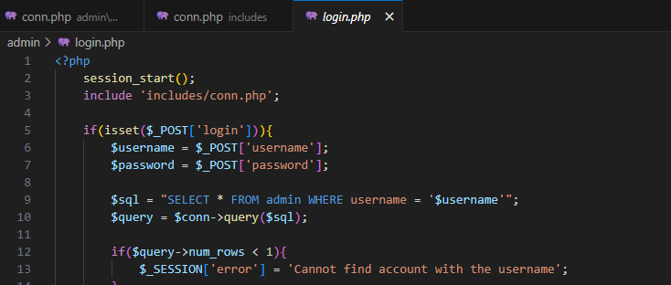
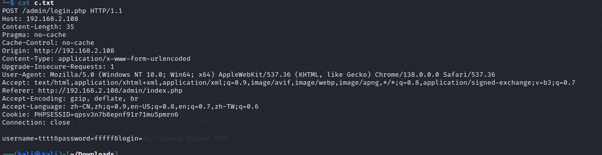
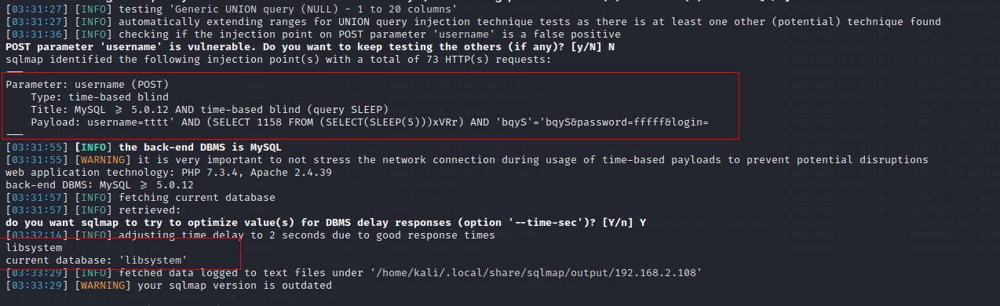

**Title:** Library Management System In PHP With Source Code (Ver.2.0) /admin/login.php sql Injection 

**Vendor:** Fabian Ros [Library Management System In PHP With Source Code (Ver.2.0) - Source Code & Projects](https://code-projects.org/library-management-system-in-php-with-source-code-ver-2-0/)

**Affected Product Version**: 2.0

**Vulnerability Type**: SQL Injection

**Audit:**

The `username` parameter was concatenated without being sanitized



**Verify**



```
 sqlmap -r c.txt -p username  --batch --current-db --flush-session
```




